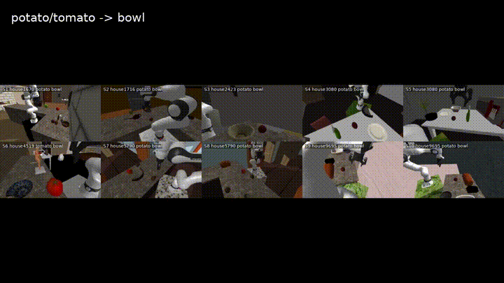

# MolmoSpaces x MimicGen

[English](README.md) | [中文](README_zh.md)

## 演示视频

### Pick-and-Place 总览

[](media/pnp_overview.mp4)

[打开 MP4](media/pnp_overview.mp4)

### 生成轨迹示例

[](media/heterogeneous_generated_examples.mp4)

[打开 MP4](media/heterogeneous_generated_examples.mp4)

### 源轨迹候选与 pilot 结果

| 源轨迹候选 | Pilot 结果 |
| --- | --- |
| [](media/foodlike_source_candidates.mp4) | [](media/foodlike_pilot_outcomes.mp4) |
| [打开 MP4](media/foodlike_source_candidates.mp4) | [打开 MP4](media/foodlike_pilot_outcomes.mp4) |

本仓库是一个 fork-style 的研究代码快照：它把 MolmoSpaces 代码库和 MolmoSpaces x MimicGen 集成层放在同一个仓库中，目标是支持 Pick-and-Place 轨迹生成，以及 bimanual YAM 的浏览器可视化和键盘遥操作。

目标是让新用户 clone 仓库后，可以安装 MolmoSpaces 环境、拉取外部 MimicGen 依赖、下载官方 MolmoBot-Data shard，然后直接运行本仓库里的集成脚本，而不依赖私有的 4090 工作目录。

## 作者与引用

- 上游 MolmoSpaces：Allen Institute for AI，Apache License 2.0。上游源码和 license 已保留在本仓库中。
- 上游 MimicGen：NVIDIA / NVlabs。MimicGen 论文作者为 Ajay Mandlekar、Soroush Nasiriany、Bowen Wen、Iretiayo Akinola、Yashraj Narang、Linxi Fan、Yuke Zhu 和 Dieter Fox。MimicGen 代码遵循 NVIDIA Source Code License，MimicGen 数据集遵循 CC-BY 4.0。
- MolmoSpaces x MimicGen 集成、实验流程整理和发布组织：Kunyu Yang，复旦大学可信具身智能研究院。
- 详细说明见 `AUTHORS.md`。

## 仓库结构

```text
molmo_spaces/             上游 MolmoSpaces Python 包
scripts/                  上游 MolmoSpaces 脚本
configs/, examples/, docs/ 上游配置、示例和文档
src/pnp/                  Pick-and-Place MimicGen 集成脚本
src/bimanual_yam/         bimanual YAM 诊断、浏览器可视化和键盘遥操作
results/                  轻量 JSON manifest 和结果摘要
media/                    GitHub README 使用的小体积演示视频
docs/experiments.md       实验流程、结果边界和证据说明
docs/upstream_molmospaces_readme.md  上游 MolmoSpaces 原始 README
tools/setup_mimicgen_dependency.sh   拉取 MimicGen 到 vendor/ 的辅助脚本
```

本仓库故意不追踪私有运行状态和大文件：`.venv`、`work/`、官方数据 shard、生成的 HDF5、完整 rollout 视频目录、simulator logs、PID 文件、cache 目录和内部 planning ledger。Git 中只保留 `media/` 下的小体积公开视频。

## Clone

```bash
git clone git@github.com:yanggoumao2/molmospaces-mimicgen.git
cd molmospaces-mimicgen
```

也可以使用 HTTPS：

```bash
git clone https://github.com/yanggoumao2/molmospaces-mimicgen.git
cd molmospaces-mimicgen
```

## 安装 MolmoSpaces

使用 Python 3.11。本仓库根目录就是可安装的 MolmoSpaces package。

使用 conda：

```bash
conda create -n molmospaces-mimicgen python=3.11
conda activate molmospaces-mimicgen
pip install -e ".[mujoco]"
```

使用 `uv`：

```bash
uv venv --python 3.11 .venv
source .venv/bin/activate
uv pip install -e ".[mujoco]"
```

可选 extras 遵循上游 MolmoSpaces，例如 `.[mujoco,grasp,housegen]`。上游安装细节见 `docs/upstream_molmospaces_readme.md`。

## 拉取 MimicGen

集成脚本需要 MimicGen 和 robomimic 代码。可以把 MimicGen 拉到 `vendor/mimicgen`：

```bash
bash tools/setup_mimicgen_dependency.sh
export MIMICGEN_ROOT=$PWD/vendor/mimicgen
```

如果你已经有本地 MimicGen checkout，也可以直接把 `MIMICGEN_ROOT` 指向那个目录。

## 环境变量

运行集成脚本前设置：

```bash
export MOLMOSPACES_ROOT=$PWD
export MOLMOSPACES_PYTHON=${MOLMOSPACES_PYTHON:-python}
export MIMICGEN_ROOT=${MIMICGEN_ROOT:-$PWD/vendor/mimicgen}
# 可选：如果 MolmoSpaces 使用本地 NLTK data cache
export MOLMOSPACES_NLTK_DATA=/path/to/nltk_data
```

创建运行目录：

```bash
export MOLMOSPACES_PNP_WORKDIR=$PWD/work/current/mimicgen_pick_and_place
mkdir -p "$MOLMOSPACES_PNP_WORKDIR"/{artifacts/seeds,artifacts/mimicgen_pnp,data/molmobot_data/FrankaPickAndPlaceOmniCamConfig/val_shards,logs}
```

## 数据

下载官方 MolmoBot Pick-and-Place validation shard 到：

```text
work/current/mimicgen_pick_and_place/data/molmobot_data/FrankaPickAndPlaceOmniCamConfig/val_shards/00000.tar
```

仓库里包含 `results/` 下的轻量 manifest 和摘要，但不包含官方 shard、生成的 HDF5、生成 rollout 或完整视频目录。

主要 manifest：

```text
results/pnp_seed_manifest.json
results/pnp_seed_manifest_homogeneous_foodlike_bowl_10candidate_v3.json
```

需要时把 manifest 复制到运行目录：

```bash
cp results/pnp_seed_manifest_homogeneous_foodlike_bowl_10candidate_v3.json \
  "$MOLMOSPACES_PNP_WORKDIR/artifacts/seeds/"
```

## Pick-and-Place 集成流程

检查源轨迹候选：

```bash
$MOLMOSPACES_PYTHON src/pnp/inspect_source_candidates.py
```

构建 foodlike-to-bowl 同质 manifest：

```bash
$MOLMOSPACES_PYTHON src/pnp/make_homogeneous_manifest.py
```

回放源轨迹：

```bash
$MOLMOSPACES_PYTHON src/pnp/replay_source_episode.py --seed-index 0 --save-videos
```

收集 MimicGen datagen 信息：

```bash
$MOLMOSPACES_PYTHON src/pnp/collect_homogeneous_datagen_info.py \
  --seed-index 0 \
  --manifest "$MOLMOSPACES_PNP_WORKDIR/artifacts/seeds/pnp_seed_manifest_homogeneous_foodlike_bowl_10candidate_v3.json" \
  --out-root "$MOLMOSPACES_PNP_WORKDIR/artifacts/replay_pnp_exact_homogeneous_foodlike_bowl_10candidate_v3"
```

把选中的源轨迹转换成 robomimic/MimicGen HDF5：

```bash
$MOLMOSPACES_PYTHON src/pnp/convert_seed_set_to_robomimic.py \
  --manifest "$MOLMOSPACES_PNP_WORKDIR/artifacts/seeds/pnp_seed_manifest_homogeneous_foodlike_bowl_10candidate_v3.json" \
  --out "$MOLMOSPACES_PNP_WORKDIR/artifacts/seeds/robomimic_pnp_foodlike_bowl_10demo_aligned.hdf5"
```

用 MimicGen 解析源 HDF5：

```bash
PNP_SOURCE_HDF5="$MOLMOSPACES_PNP_WORKDIR/artifacts/seeds/robomimic_pnp_foodlike_bowl_10demo_aligned.hdf5" \
$MOLMOSPACES_PYTHON src/pnp/parse_source_dataset.py
```

生成一条 rollout：

```bash
$MOLMOSPACES_PYTHON src/pnp/generate_pick_place_rollout.py \
  --source-hdf5 "$MOLMOSPACES_PNP_WORKDIR/artifacts/seeds/robomimic_pnp_foodlike_bowl_10demo_aligned.hdf5" \
  --target-manifest "$MOLMOSPACES_PNP_WORKDIR/artifacts/seeds/pnp_seed_manifest_homogeneous_foodlike_bowl_10candidate_v3.json" \
  --demo-keys demo_2 \
  --seed-index 2 \
  --out-name example_target02_src02 \
  --interp 1 --fixed 0 --noise 0.0 \
  --transform-first-robot-pose \
  --post-hold-steps 30 \
  --save-videos
```

非去重 baseline collector：

```bash
TARGET_SUCCESS=100 MAX_ATTEMPTS=800 bash src/pnp/collect_uniform_successes.sh
```

带 action-hash 去重的 high-yield collector：

```bash
PREVIOUS_COLLECTOR_RUN=logs/collect_uniform_successes_YYYYMMDD_HHMMSS \
TARGET_SUCCESS=100 MAX_ATTEMPTS=500 \
bash src/pnp/collect_unique_highyield_successes.sh
```

## Bimanual YAM 浏览器遥操作

只读浏览器视频流：

```bash
$MOLMOSPACES_PYTHON src/bimanual_yam/browser_viewer.py --host 127.0.0.1 --port 8765
```

键盘遥操作：

```bash
$MOLMOSPACES_PYTHON src/bimanual_yam/browser_keyboard_teleop.py --host 127.0.0.1 --port 8765
```

浏览器遥操作路径证明的是控制和观测桥接，不等于完成任务 demonstration。

## 当前结果快照

- heterogeneous Pick-and-Place whole-source generation：`10/10` accepted generated rollouts，满足 full rollout、final success、persistent success 和 30-step post-hold。见 `results/whole_source_transformfirst_summary.json`。
- homogeneous foodlike-to-bowl pilot：严格自动成功 `13/100`；人工复核视觉成功 `15/100`，其中包含两个 one-frame trace-glitch case。
- uniform collector live snapshot：见 `results/collector_uniform_summary_live.json`，未去重。
- high-yield deduplicated collector live snapshot：见 `results/collector_highyield_dedup_summary_live.json`，按 action hash 去重。

这些 snapshot 不能被表述为最终 100-success 数据集。

## 证据边界

- 源轨迹来自 MolmoBot-Data 的 synthetic planner expert trajectories，不是 human demonstrations。
- replay success 和 parser success 是前置检查，不等于生成 demo 成功。
- accepted generated demonstration 需要真实 MolmoSpaces simulator rollout、`final_success=true`、post-hold stability 和保存的 artifacts。
- 大体积生成 artifacts 故意不放进 Git。

## License

上游 MolmoSpaces 代码遵循 Apache License 2.0，见 `LICENSE`。第三方依赖和数据集保留各自 license。本仓库中的 MimicGen integration 研究代码默认遵循同一仓库 license，除非文件内另有说明。
