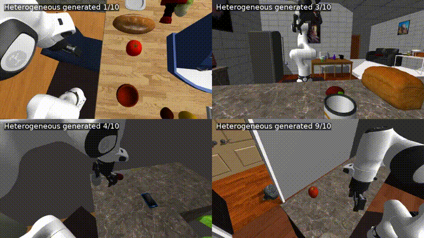
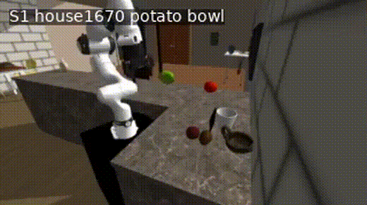
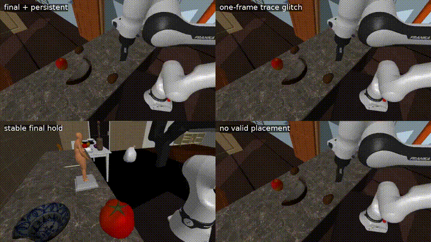
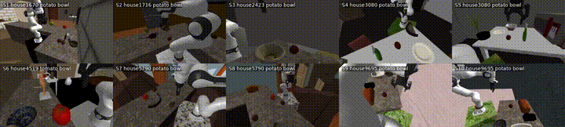

<div align="center">
  
</div>

<p align="center">
  <a href="README.md">English</a> | <a href="README_zh.md">中文</a>
</p>

<p align="center">
  <strong>MolmoSpaces Integration</strong> — Pick-and-Place MimicGen 轨迹生成、bimanual YAM 遥操作及其他 MolmoSpaces 集成工作线。
</p>

<p align="center">
  
  &nbsp;
  
  &nbsp;
  
</p>

<p align="center">
  <a href="media/heterogeneous_generated_examples.mp4">生成示例</a>
  &nbsp;·&nbsp;
  <a href="media/foodlike_source_candidates_grid.mp4">源轨迹候选</a>
  &nbsp;·&nbsp;
  <a href="media/foodlike_pilot_outcomes.mp4">Pilot 结果</a>
</p>

<p align="center"><em>预览保持紧凑；点击 MP4 链接查看完整尺寸演示。</em></p>

## 包含内容

本仓库是 MolmoSpaces 集成工作线合集。首页直接列出全部公开 workline，读者无需翻子目录即可了解仓库包含的所有方向。

| 工作线 | 详细 README | 代码入口 | 证据 / inventory | 状态 |
|---|---|---|---|---|
| MimicGen Pick-and-Place | [`docs/worklines/mimicgen_pick_and_place/README.md`](docs/worklines/mimicgen_pick_and_place/README.md) | [`src/pnp/`](src/pnp/) | [`results/workline_index/mimicgen_pick_and_place.md`](results/workline_index/mimicgen_pick_and_place.md) | Active / primary |
| 50-demo MimicGen cross-subtask route | [`docs/worklines/mimicgen_50cross/README.md`](docs/worklines/mimicgen_50cross/README.md) | [`src/pnp/*50cross*`](src/pnp/) | [`results/50cross_selectsrc_pilot_20260727_182533/`](results/50cross_selectsrc_pilot_20260727_182533/) | Diagnostic |
| Bimanual YAM browser teleop | [`docs/worklines/bimanual_yam_browser_teleop/README.md`](docs/worklines/bimanual_yam_browser_teleop/README.md) | [`src/bimanual_yam/`](src/bimanual_yam/) | [`results/workline_index/ithor_bimanual_yam.md`](results/workline_index/ithor_bimanual_yam.md) | Infrastructure |
| iTHOR bimanual YAM | [`docs/worklines/ithor_bimanual_yam/README.md`](docs/worklines/ithor_bimanual_yam/README.md) | [`src/bimanual_yam/`](src/bimanual_yam/) | [`results/workline_index/ithor_bimanual_yam.md`](results/workline_index/ithor_bimanual_yam.md) | In progress |
| Custom-scene bimanual YAM baseline | [`docs/worklines/bimanual_yam_source_baseline/README.md`](docs/worklines/bimanual_yam_source_baseline/README.md) | Inventory / regeneration entrypoints | [`results/workline_index/bimanual_yam_source_baseline.md`](results/workline_index/bimanual_yam_source_baseline.md) | Completed |
| MolmoAct2 → MolmoSpaces legacy | [`docs/worklines/molmoact2_legacy/README.md`](docs/worklines/molmoact2_legacy/README.md) | [`src/molmoact2_legacy/`](src/molmoact2_legacy/) | [`results/workline_index/molmoact2_integration_legacy.md`](results/workline_index/molmoact2_integration_legacy.md) | Legacy |
| MolmoSpaces bounded reproduction | [`docs/worklines/molmospaces_official_reproduction/README.md`](docs/worklines/molmospaces_official_reproduction/README.md) | Upstream MolmoSpaces entrypoints | [`results/workline_index/molmospaces_official_reproduction.md`](results/workline_index/molmospaces_official_reproduction.md) | Completed |
| MimicGen single-arm groundwork | [`docs/worklines/mimicgen_single_arm/README.md`](docs/worklines/mimicgen_single_arm/README.md) | 已由 [`src/pnp/`](src/pnp/) 继承 | [`results/workline_index/mimicgen_single_arm.md`](results/workline_index/mimicgen_single_arm.md) | Historical |

同时包含：上游 MolmoSpaces 源码快照、`results/` 下的轻量 manifest 和 summary、`media/` 下的演示媒体、公开文档和 attribution 文件。

大体积运行数据不提交到 Git：官方 shards、生成的 HDF5、rollout 目录、simulator logs、PID 文件、cache、视频、本地机器路径和内部 planning ledger。使用此类文件的 workline 会在仓库中保留 README、轻量 inventory 或再生成入口，而非提交原始产物。

## 主复现路线

本仓库的主流程是：

> Franka Pick-and-Place datagen -> 验收 HDF5/视频 -> 转换为 MimicGen source 并生成 rollout

命令行参数 `--robot droid` 表示 **Franka 机器人搭配 DROID 风格相机**，不是 RB-Y1。RB-Y1 的 CuRobo/planner-server pipeline 是另一条可选上游工作线，不是下面 Franka 主流程的依赖。只有确实需要 RB-Y1 时，才阅读 [`docs/worklines/molmospaces_official_reproduction/README.md`](docs/worklines/molmospaces_official_reproduction/README.md)。

## Franka Datagen Quick Start

### 1. Clone

```bash
git clone https://github.com/yanggoumao2/molmospaces-integration.git
cd molmospaces-integration
```

也可以使用 SSH：

```bash
git clone git@github.com:yanggoumao2/molmospaces-integration.git
cd molmospaces-integration
```

### 2. 创建 Python 环境

MolmoSpaces 使用 Python 3.11。

使用 conda：

```bash
conda create -n molmospaces-integration python=3.11
conda activate molmospaces-integration
python -m pip install --upgrade pip setuptools wheel
```

使用 `uv`：

```bash
uv venv --python 3.11 .venv
source .venv/bin/activate
uv pip install --upgrade pip setuptools wheel
```

### 3. 安装 Franka datagen 依赖

安装 MolmoSpaces 的 MuJoCo extra。Franka datagen 不需要 CuRobo，也不需要 RB-Y1 planner server。

```bash
pip install -e ".[mujoco]"
export PYTHONPATH=$PWD:${PYTHONPATH:-}
```

如果机器使用 SOCKS proxy 且 `httpx` 报缺少 `socksio`，安装：

```bash
pip install httpx[socks]
```

首次运行会下载模型和仿真资源，先设置持久 cache 路径：

```bash
export HF_HOME=${HF_HOME:-$HOME/.cache/huggingface}
export NLTK_DATA=${NLTK_DATA:-$HOME/nltk_data}
export MOLMOSPACES_NLTK_DATA=$NLTK_DATA
```

### 4. 验证基础安装

```bash
python - <<'PY'
import mujoco
import torch
import warp
import molmo_spaces

print("MolmoSpaces:", molmo_spaces.__file__)
print("MuJoCo:", mujoco.__version__)
print("Torch:", torch.__version__)
print("Torch CUDA:", torch.cuda.is_available())
print("Warp CUDA:", warp.is_cuda_available())
PY
```

### 5. 查看固定 Franka PnP pools

```bash
python scripts/datagen/run_pipeline.py --list_pools
```

每个 pool 固定 scene dataset、split、house、pickup object 和 receptacle。在目标机器通过完整行为与产物 gate 之前，这些 pool 仍是研究候选。

### 6. Franka datagen 参数参考

| 参数 | 含义与约束 |
|---|---|
| `--pool NAME` | 选择固定的 MolmoData-derived PnP identity。它会覆盖 `--scene_dataset`、`--data_split`、`--house_inds`、`--pickup_obj_name` 和 `--fixed_place_receptacle_uid`；要求 `--task_type pick_and_place`，且不能与 `--config` 或 `--eval` 同时使用。 |
| `--samples_per_house N` | 每个 house 目标保存的轨迹数。Sampling 或 IK 失败可能让 run 提前结束，因此必须核验实际 success count 和 HDF5 trajectory count。 |
| `--device gpu` | 让 Franka Warp parallel IK 使用 CUDA；MuJoCo physics 仍在 CPU。`--device cpu` 是较慢的 fallback。 |
| `CUDA_VISIBLE_DEVICES=K` | 选择 Warp 可见的物理 GPU。仅设置 `--device gpu` 不负责选择具体物理 GPU。 |
| `--num_workers N` | 设置 rollout worker 进程数。Worker 消费 runner 生成的独立 work item；一个 work item 不会被拆分。实际并行度取决于生成的 batches，增加 worker 不保证线性加速或一定完成目标数。 |
| `--seed N` | 控制 task sampling 和 randomization。续采时每个 run 使用新 seed，避免重复相同随机序列。 |
| `--run_name_prefix NAME` | 为时间戳输出目录增加可读且唯一的前缀。不同 seed 和 pool 使用不同 prefix。 |
| `--randomize_fixed_pickup_pose` | 在已发现的原始 supporting geometry 上重采样固定 pickup，距离范围由 `--fixed_pickup_min_dist` 和 `--fixed_pickup_max_dist` 控制。 |
| `--filter_for_successful_trajectories` | 只把成功轨迹保存为 source candidate，不保留失败轨迹。 |
| `--disable_action_noise` | 关闭逐步 robot action noise，用于受控 source collection。 |
| `--require_clean_success` | 将 planner retry 设为零，并拒绝发生任何 retry 的轨迹；要求支持该字段的 object-manipulation planner。 |

每个 pool 应使用独立的 output/source dataset。不要混合不同 pool 的 identity 后把结果称为 homogeneous source pool。输出目录是 `ASSETS_DIR/datagen/<task_type>_<policy>_v1/<prefix>_<timestamp>`；所以下面的命令输出到 `datagen/pick_and_place_planner_v1/` 下。

### 7. 运行有界 Franka PnP datagen smoke

在原生 Linux NVIDIA 机器上，为 Warp parallel IK 选择 GPU；MuJoCo physics 仍在 CPU：

```bash
export CUDA_VISIBLE_DEVICES=0

python scripts/datagen/run_pipeline.py \
  --robot droid --policy planner --task_type pick_and_place \
  --pool molmodata_potato_bowl_1716 \
  --samples_per_house 1 --randomize_fixed_pickup_pose \
  --filter_for_successful_trajectories \
  --disable_action_noise --require_clean_success \
  --device gpu --num_workers 1 \
  --seed 111 --run_name_prefix fresh_clone_smoke
```

这里 `--robot droid` 实际使用 `FrankaRobotConfig` 和 `FrankaDroidCameraSystem`。`--device cpu` 只建议作为较慢的诊断 fallback。WSL2 不提供 MolmoSpaces headless rendering 所需的 NVIDIA EGL device extension，因此完整 GPU 渲染 datagen 验收需要带 NVIDIA EGL vendor 配置的原生 Linux。

`samples_per_house=1` 只是请求保存一条轨迹，不证明已经生成有效 demo。只有进程正常退出、输出目录包含非空 HDF5 和预期视频、数组 finite、task identity 与 pool 一致、planner phases 覆盖完整行为、视频/replay 显示 approach 到稳定 release，并且没有 planner retry，才能验收 datagen。

生成文件位于运行日志打印的 MolmoSpaces resource datagen 目录。仅有 config 构造、scene load 或 HDF5 文件不能证明 datagen 成功。

## 继续进入 MimicGen

先完成 Franka datagen 与产物验收，再把 HDF5 作为 MimicGen source。

### 1. 拉取固定版本的 MimicGen 和 robomimic

`vendor/` 不直接提交到 Git。请用脚本拉取本工作线实际使用的 upstream commit：

```bash
bash tools/setup_mimicgen_dependency.sh
```

当前 pin：

- MimicGen: `72bd767c255545f462e7ccfb2731f2e5d4c1d9bb`
- robomimic: `e10526b9a40c78b41f1e37e60041dc0ec0a5f60f`

editable 安装：

```bash
pip install -e vendor/robomimic
pip install -e vendor/mimicgen
```

设置依赖路径和 `PYTHONPATH`：

```bash
export MIMICGEN_ROOT=$PWD/vendor/mimicgen
export ROBOMIMIC_ROOT=$PWD/vendor/robomimic
export PYTHONPATH=$PWD:$MIMICGEN_ROOT:$ROBOMIMIC_ROOT:${PYTHONPATH:-}
```

如果使用已有本地 checkout，把 `MIMICGEN_ROOT` 和 `ROBOMIMIC_ROOT` 指向对应目录即可。

### 2. 设置运行路径

```bash
export MOLMOSPACES_ROOT=$PWD
export MOLMOSPACES_PYTHON=python
export MOLMOSPACES_PNP_WORKDIR=$PWD/runtime/mimicgen_pick_and_place
export HF_HOME=${HF_HOME:-$HOME/.cache/huggingface}
export NLTK_DATA=${NLTK_DATA:-$HOME/nltk_data}
export MOLMOSPACES_NLTK_DATA=$NLTK_DATA

mkdir -p "$MOLMOSPACES_PNP_WORKDIR"/{artifacts/seeds,artifacts/mimicgen_pnp,data/molmobot_data/FrankaPickAndPlaceOmniCamConfig/val_shards,logs}
```

`HF_HOME` 会被 robomimic 的 CLIP language embedding 工具使用。`NLTK_DATA` / `MOLMOSPACES_NLTK_DATA` 用于 MolmoSpaces 需要本地 WordNet cache 的情况。

### 3. 从两种 MimicGen source 选项中选择一种

两种选项都会生成同一份 `pnp_seed_manifest_50demo_crossmix.json` contract，之后共用下面的 replay、datagen-info collection、robomimic conversion 和 MimicGen generation 命令。一个 dataset 选择一种 source 路线，不要隐式混合 provenance。

#### 选项 A：官方预采集 MolmoData / MolmoBot-Data source shard

当前 integration 文件把这类 source 称为 `MolmoBot-Data`，固定 pool 的 provenance label 使用 `MolmoData`。下载官方 Franka Pick-and-Place validation shard 并放到：

```text
runtime/mimicgen_pick_and_place/data/molmobot_data/FrankaPickAndPlaceOmniCamConfig/val_shards/00000.tar
```

使用 selector 的默认 shard 模式生成 source manifest：

```bash
PNP_SELECT_N=50 $MOLMOSPACES_PYTHON src/pnp/select_pnp_50_source_pool.py
```

#### 选项 B：本地采集的 Franka datagen HDF5

将同一个 selector 指向一个已验收的 Franka run 目录，或多个已验收 run 的共同父目录：

```bash
PNP_SELECT_N=50 $MOLMOSPACES_PYTHON src/pnp/select_pnp_50_source_pool.py \
  --franka-datagen-root /path/to/datagen/pick_and_place_planner_v1
```

Franka 模式递归读取 `house_*/trajectories_batch_*.h5`，要求 terminal/persistent success、完整 `0..9` planner phases、末帧 `task_info.success=true`、下游 replay 所需字段和唯一初始状态/动作指纹。

本仓库包含轻量 manifest 和摘要，不包含官方 shards、本地生成的 HDF5、视频或其他 runtime artifacts。

### 4. 首次运行资源 cache 说明

MolmoSpaces 首次运行时可能下载/解压 iTHOR assets。如果中途被打断，可能出现类似错误：

```text
Directory path exists on disk but is not recorded in the cache manifest
```

不要手改 manifest。把报错中提到的未注册资源目录移动到 backup，再重跑，让资源管理器重新解压并登记。例如：

```bash
mkdir -p "$HOME/.cache/molmo-spaces-resources_broken_backup"
mv "$HOME/.cache/molmo-spaces-resources/objects/thor/20251117" \
  "$HOME/.cache/molmo-spaces-resources_broken_backup/thor_20251117_$(date +%Y%m%d_%H%M%S)"
```

如果网络需要代理，请在首次下载 asset/model 前设置代理环境变量。

### 5. 运行 MolmoBot source replay smoke check

把 manifest 复制到运行目录：

```bash
cp results/pnp_seed_manifest_homogeneous_foodlike_bowl_10candidate_v3.json \
  "$MOLMOSPACES_PNP_WORKDIR/artifacts/seeds/"
```

检查源轨迹候选，查看哪些 MolmoBot-Data 轨迹可以用作 source：

```bash
$MOLMOSPACES_PYTHON src/pnp/inspect_source_candidates.py
```

回放一条源轨迹，验证回放管线正常工作：

```bash
$MOLMOSPACES_PYTHON src/pnp/replay_source_episode.py --seed-index 0 --save-videos
```

## MolmoSpaces 工作线合集

上方的工作线表格同步维护在 [`docs/worklines/README.md`](docs/worklines/README.md) 中。每条 workline 有独立的 README 详细文档，即使其原始 HDF5/视频不在 Git 中。

MolmoAct2 官方 `sim_eval` 成功、MolmoSpaces adapter 诊断、bimanual 浏览器遥操作、custom-scene YAM baseline、iTHOR source-demo 基础设施和 Pick-and-Place MimicGen rollout 是独立的证据层级，不应混为一谈。

## Pick-and-Place 集成流程

Pick-and-Place pipeline 接受通过验收的 Franka datagen HDF5 或 MolmoBot-Data 源轨迹，然后生成 MimicGen rollout：

1. 检查或准备 source candidate 元数据；
2. 回放 source trajectory 并收集 MimicGen datagen 信息；
3. 把选中 source 转成 robomimic/MimicGen source HDF5；
4. 用 MimicGen 解析 source HDF5；
5. 在 MolmoSpaces 中生成 rollout 并保存视频；
6. 可选：用 action-hash 去重收集 accepted rollouts。

### 收集 MimicGen datagen 信息

回放源轨迹，提取 MimicGen 空间变换所需的观测和动作数据：

```bash
$MOLMOSPACES_PYTHON src/pnp/collect_homogeneous_datagen_info.py \
  --seed-index 0 \
  --manifest "$MOLMOSPACES_PNP_WORKDIR/artifacts/seeds/pnp_seed_manifest_homogeneous_foodlike_bowl_10candidate_v3.json" \
  --out-root "$MOLMOSPACES_PNP_WORKDIR/artifacts/replay_pnp_exact_homogeneous_foodlike_bowl_10candidate_v3"
```

### 转换为 robomimic/MimicGen source HDF5

把选中的源轨迹打包成一个 robomimic 兼容的 HDF5 文件：

```bash
$MOLMOSPACES_PYTHON src/pnp/convert_seed_set_to_robomimic.py \
  --manifest "$MOLMOSPACES_PNP_WORKDIR/artifacts/seeds/pnp_seed_manifest_homogeneous_foodlike_bowl_10candidate_v3.json" \
  --out "$MOLMOSPACES_PNP_WORKDIR/artifacts/seeds/robomimic_pnp_foodlike_bowl_10demo_aligned.hdf5"
```

### 用 MimicGen 解析 source HDF5

将 source HDF5 加载到 MimicGen 的 dataset 格式并查看属性：

```bash
PNP_SOURCE_HDF5="$MOLMOSPACES_PNP_WORKDIR/artifacts/seeds/robomimic_pnp_foodlike_bowl_10demo_aligned.hdf5" \
$MOLMOSPACES_PYTHON src/pnp/parse_source_dataset.py
```

### 生成 MolmoSpaces rollout

用 MimicGen 的 object-centric 空间变换，将源轨迹迁移到新场景布局：

```bash
$MOLMOSPACES_PYTHON src/pnp/generate_pick_place_rollout.py \
  --source-hdf5 "$MOLMOSPACES_PNP_WORKDIR/artifacts/seeds/robomimic_pnp_foodlike_bowl_10demo_aligned.hdf5" \
  --target-manifest "$MOLMOSPACES_PNP_WORKDIR/artifacts/seeds/pnp_seed_manifest_homogeneous_foodlike_bowl_10candidate_v3.json" \
  --demo-keys demo_2 \
  --seed-index 2 \
  --out-name example_target02_src02 \
  --interp 1 --fixed 0 --noise 0.0 \
  --transform-first-robot-pose \
  --post-hold-steps 30 \
  --save-videos
```

### 50-demo cross-subtask MimicGen 路线

以上流程每个 rollout 使用一条源 demo。cross-subtask 路线使用更大的 50-demo 源池，调用 MimicGen `select_src_per_subtask=True`，允许同一 rollout 的不同子任务从不同源 demo 采样：

```bash
# 严格选择一种路线来选取 50 条 sources。
# 选项 A：官方 MolmoData / MolmoBot-Data shard（默认模式）。
$MOLMOSPACES_PYTHON src/pnp/select_pnp_50_source_pool.py

# 选项 B：本地采集的 Franka HDF5（与选项 A 二选一）。
PNP_SELECT_N=50 $MOLMOSPACES_PYTHON src/pnp/select_pnp_50_source_pool.py \
  --franka-datagen-root /path/to/datagen/pick_and_place_planner_v1

# 收集候选的严格回放 + datagen_info。
bash src/pnp/run_collect_50cross_datagen_parallel.sh
# 或单个候选：
$MOLMOSPACES_PYTHON src/pnp/collect_datagen_info_50cross.py \
  --seed-index 0 \
  --manifest "$MOLMOSPACES_PNP_WORKDIR/artifacts/seeds/pnp_seed_manifest_50demo_crossmix.json" \
  --out-root "$MOLMOSPACES_PNP_WORKDIR/artifacts/replay_pnp_exact_50cross"

# 从 hard-pass 源构建 50-demo MimicGen source HDF5。
$MOLMOSPACES_PYTHON src/pnp/convert_seed_set_to_robomimic_50cross.py \
  --accepted all \
  --manifest "$MOLMOSPACES_PNP_WORKDIR/artifacts/seeds/pnp_seed_manifest_50demo_crossmix.json" \
  --replay-root "$MOLMOSPACES_PNP_WORKDIR/artifacts/replay_pnp_exact_50cross" \
  --out "$MOLMOSPACES_PNP_WORKDIR/artifacts/seeds/robomimic_pnp_50demo_crossmix_aligned.hdf5"

# 运行 select-src-per-subtask pilot。
bash src/pnp/run_50cross_selectsrc_pilot.sh
```

跨 house、物体和容器的随机混合会暴露 geometry、contact、IK 和子任务拼接兼容性问题。此路线目前为诊断性质，下一步是 compatibility-filtered cross-subtask 路线。

### 批量收集

非去重 baseline collector（收集所有满足成功条件的 rollout，可能包含重复）：

```bash
TARGET_SUCCESS=100 MAX_ATTEMPTS=800 bash src/pnp/collect_uniform_successes.sh
```

带 action-hash 去重的 high-yield collector（跳过动作序列与已收集轨迹相同的 rollout）：

```bash
PREVIOUS_COLLECTOR_RUN=logs/collect_uniform_successes_YYYYMMDD_HHMMSS \
TARGET_SUCCESS=100 MAX_ATTEMPTS=500 \
bash src/pnp/collect_unique_highyield_successes.sh
```

## Bimanual YAM 浏览器遥操作

bimanual YAM 场景的浏览器键盘遥操作工具。公开复现推荐入口是键盘遥操作 bridge，它会先执行当前 strict tabletop 初始化，再启动浏览器 UI。旧的只读 viewer 脚本不是此工作线推荐复现入口。

### 运行环境要求

- **需要 GPU 渲染**才能达到可用帧率。CPU 软件渲染（OSMesa）三相机模式下仅 ~3 FPS，键盘控制响应延迟严重。
- **NVIDIA EGL headless 渲染**是已验证的配置：Linux 主机 + NVIDIA GPU + NVIDIA 闭源驱动 + EGL vendor 文件（`/usr/share/glvnd/egl_vendor.d/10_nvidia.json`）。遥操作工具通过 MolmoSpaces 自动使用 `MUJOCO_GL=egl`。
- **WSL2 不支持**此工作线。WSL2 使用 Mesa EGL，不暴露 `EGL_EXT_platform_device` 扩展——这是 MolmoSpaces headless GPU 渲染依赖的扩展。如果使用 WSL2，请在远程 Linux GPU 服务器上运行（见下方说明）。

### 本地运行（Linux + NVIDIA GPU）

启动遥操作 bridge：

```bash
$MOLMOSPACES_PYTHON src/bimanual_yam/browser_keyboard_teleop.py \
  --host 127.0.0.1 \
  --port 8765 \
  --house-index 1 \
  --seed 110 \
  --render-fps 8 \
  --control-hz 25 \
  --input-timeout-ms 400 \
  --initialization-max-attempts 50 \
  --initialization-report runtime/bimanual_yam_initialization_report.json
```

终端打印本地 teleoperation URL 后打开 `http://127.0.0.1:8765`。

### 在远程 GPU 服务器上运行

如果 teleop 运行在远程 Linux GPU 服务器上，需要建立 SSH tunnel 将浏览器端口转发到本地机器：

```bash
# 在本地机器上执行：
ssh -L 8765:127.0.0.1:8765 user@your-gpu-server
```

然后在本地浏览器打开 `http://127.0.0.1:8765`。

### 浏览器键位

先点击页面；`Tab` 切换 active arm；`W/S/A/D` 在视觉平面移动；`E/Q` 上下；方向键控制 pitch/yaw；`Z/C` roll；`F` 切换当前夹爪。如果初始化失败，增大 `--initialization-max-attempts` 或查看 `runtime/bimanual_yam_initialization_report.json`。

## 当前结果快照

- **Heterogeneous Pick-and-Place whole-source generation**：`10/10` accepted generated rollouts，均满足 full rollout、final success、persistent success 和 30-step post-hold。见 `results/whole_source_transformfirst_summary.json`。
- **Homogeneous foodlike-to-bowl pilot**：严格自动成功 `13/100`；人工复核视觉成功 `15/100`，包含两个 one-frame trace-glitch case。
- **50-demo cross-subtask source pool**：`51` 个严格回放/datagen-info hard-pass 候选被筛选，`50` 个选入 `robomimic_pnp_50demo_crossmix_aligned.hdf5`，共 `9286` source action rows。见 `results/pnp_50cross_selected_hardpass_indices.json` 和 `results/robomimic_pnp_50demo_crossmix_aligned.summary.json`。
- **Broad random `select_src_per_subtask=True` pilot**：首批样本暴露了 geometry/contact/source-compatibility 问题。轻量日志和生成轨迹见 `results/50cross_selectsrc_pilot_20260727_182533/`，大体积视频/HDF5/数组不在 Git 中。
- **Uniform collector live snapshot**：见 `results/collector_uniform_summary_live.json`，未去重。
- **High-yield dedup collector live snapshot**：见 `results/collector_highyield_dedup_summary_live.json`，按 action hash 去重。

<details>
<summary>演示媒体</summary>

### 生成轨迹示例

[](media/heterogeneous_generated_examples.mp4)

[打开 MP4](media/heterogeneous_generated_examples.mp4)

### 源轨迹候选

[](media/foodlike_source_candidates_grid.mp4)

[打开 MP4](media/foodlike_source_candidates_grid.mp4)

### Pilot 结果

[](media/foodlike_pilot_outcomes.mp4)

[打开 MP4](media/foodlike_pilot_outcomes.mp4)

</details>

## 仓库结构

```text
molmo_spaces/             上游 MolmoSpaces Python 包
scripts/                  上游 MolmoSpaces 脚本
configs/, examples/, docs/ 上游配置、示例和文档
src/pnp/                  Pick-and-Place MimicGen 集成脚本
src/bimanual_yam/         bimanual YAM 诊断、浏览器可视化和键盘遥操作
results/                  轻量 JSON manifest 和结果摘要
media/                    GitHub README 使用的小体积演示视频
docs/experiments.md       实验流程、结果边界和证据说明
docs/upstream_molmospaces_readme.md  上游 MolmoSpaces 原始 README
tools/setup_mimicgen_dependency.sh   拉取 MimicGen 和 robomimic 到 vendor/ 的辅助脚本
```

## 证据边界

- Source trajectories 是 MolmoBot-Data 中的 synthetic planner expert trajectories，不是 human demonstrations。
- Replay success 和 parser success 是前置条件，不等于 generated-demo success。
- Accepted generated demonstrations 需要真实 MolmoSpaces simulator rollout、`final_success=true`、post-hold stability 和保存的 artifacts。

## 作者与引用

- 上游 MolmoSpaces：Allen Institute for AI，Apache License 2.0。上游源码和 license 已保留在本仓库中。
- 上游 MimicGen：NVIDIA / NVlabs。MimicGen 论文作者为 Ajay Mandlekar、Soroush Nasiriany、Bowen Wen、Iretiayo Akinola、Yashraj Narang、Linxi Fan、Yuke Zhu 和 Dieter Fox。MimicGen 代码遵循 NVIDIA Source Code License，MimicGen 数据集遵循 CC-BY 4.0。
- MolmoSpaces Integration：Kunyu Yang，复旦大学可信具身智能研究院。
- 详细说明见 `AUTHORS.md`。

## License

上游 MolmoSpaces 代码遵循 Apache License 2.0；见 `LICENSE`。第三方依赖和数据集保留各自 license。本仓库中的集成代码按本仓库 license 作为 research code 发布，除非文件另有说明。
